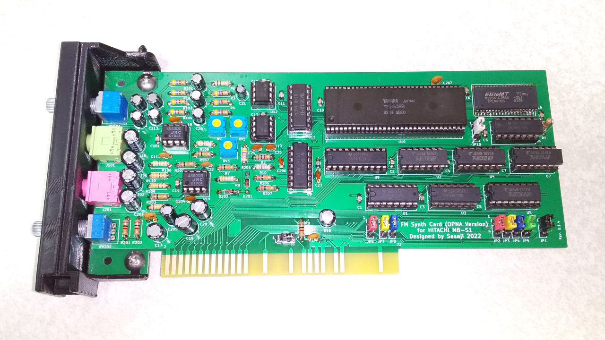

# FM音源カード for 日立 MB-S1 (OPNA (YM2608) バージョン)

## フォルダ構成

    BackCover/ ..................... 背面カバーの3Dモデル
    Board/ ......................... 基板設計(KiCAD 6.0)

-----
# FM Synthesis Card for HITACHI MB-S1 (OPNA (YM2608) Version)

## Folders:

    BackCover/ ..................... 3D models of the back cover
    Board/ ......................... The circuit board design (KiCAD 6.0)

